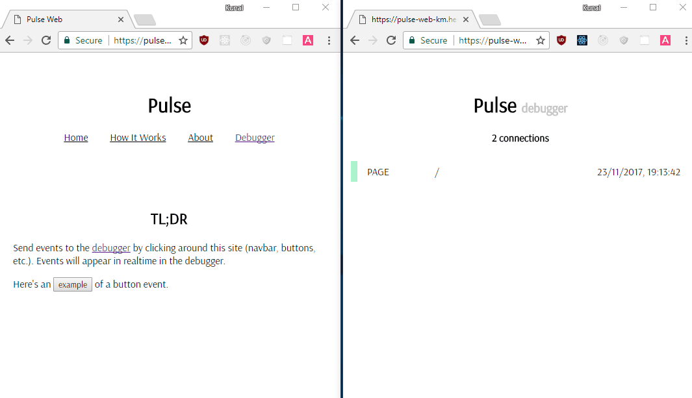

# pulse-web 

Real-time analytics with socket.io inspired by segment.com's debugger.

## Demo
- pulse-web SPA to emit events: [https://pulse-web-km.herokuapp.com/](https://pulse-web-km.herokuapp.com/)
- pulse-web debugger to present incoming events in real-time: [https://pulse-web-km.herokuapp.com/](https://pulse-web-km.herokuapp.com/debugger)

## Install
- `git clone https://github.com/kunal-mandalia/pulse-web.git`
- `cd pulse-web`
- `yarn install`
- `yarn start`
- Open `localhost:3000` to see the SPA which will be used to emit events and `localhost:3000/debugger` to show incoming events

The backend socket.io server is hosted at `http://pulse-server-km.herokuapp.com/`. Checkout the sourcecode [here](https://github.com/kunal-mandalia/pulse-server)

## Contributing
PRs welcome

## License
MIT